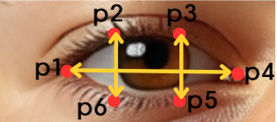

# WatchOut!

WatchOut은 영상 기반 운전자 모니터링 시스템입니다. 

AArch64 기반 Linux 환경에서 작동하도록 제작되었습니다.


## 시스템 요구사항
* OpenGL ES 버전 3.2 이상을 지원하는 GPU ([MediaPipe의 GPU 요구사항](https://ai.google.dev/edge/mediapipe/framework/getting_started/gpu_support)을 충족하면 됩니다.)
* RAM 4GB 이상, Swap memory 4GB 이상
* 카메라
* OpenCV


## 프로그램 설치 방법
WatchOut에는 [Dlib](http://dlib.net/)과 [MediaPipe](https://ai.google.dev/edge/mediapipe/solutions/guide) 두 개의 외부 라이브러리가 사용되었습니다. 이중 MediaPipe는 Bazel을 사용하여 동적 라이브러리(.so) 파일을 생성해야 프로그램 빌드가 가능합니다. 이 레포지토리에는 AArch64 기반 Linux 환경에서 사용할 수 있는 라이브러리 파일이 생성돼 있습니다.

### 방법 1
외부 라이브러리가 생성돼 있는 현재 레포지토리에서 빌드

```
git clone <this-repository-link>
cd watchout
mkdir build
cd build
cmake ..
cmake --build . --config Release -j5
./WatchOut
```

### 방법 2
MediaPipe에서 라이브러리 파일을 직접 생성 후 WatchOut 빌드

동적 라이브러리 파일이 작동하지 않거나 MediaPipe의 다른 기능을 사용하시려면 이 방법을 따라 주세요. Bazel이 설치되어 있어야 합니다.

1. Bazel로 iris_tracking_gpu 샘플 코드 빌드
	```
	git clone <this-repository-link>
	cd watchout/dependencies/mediapipe
	bazel build -c opt --copt -DMESA_EGL_NO_X11_HEADERS --copt -DEGL_NO_X11 mediapipe/examples/desktop/iris_tracking:iris_tracking_gpu
	```

2. 작동 확인
	```
	GLOG_logtostderr=1 bazel-bin/mediapipe/examples/desktop/hand_tracking/hand_tracking_gpu --calculator_graph_config_file=mediapipe/graphs/hand_tracking/hand_tracking_desktop_live_gpu.pbtxt
	```

3. Iris tracking 동적 라이브러리 생성
	```
	bazel build -c opt --copt -DMESA_EGL_NO_X11_HEADERS --copt -DEGL_NO_X11 mediapipe/examples/desktop:librun_graph_main_gpu.so
	```

4. `WatchOut` 빌드
	```
	cd ../../build
	cmake ..
	cmake --build . --config Release -j5
	```

### 방법 3
From scratch

[dependencies/mediapipe](./dependencies/mediapipe) 내의 파일들은 CMake를 사용해 WatchOut을 빌드할 수 있도록 수정되어 있습니다. 방법 3은 파일 수정 과정을 포함하고 있습니다.

0. MediaPipe를 원본 버전으로 복원
	```
	git clone <this-repository-link>
	cd watchout/dependencies/
	rm -rf mediapipe
	git clone https://github.com/google-ai-edge/mediapipe
	```

1. Bazel로 iris_tracking_gpu 샘플 코드 빌드
	```
	cd mediapipe/
	bazel build -c opt --copt -DMESA_EGL_NO_X11_HEADERS --copt -DEGL_NO_X11 mediapipe/examples/desktop/iris_tracking:iris_tracking_gpu
	```

2. 작동 확인
	```
	GLOG_logtostderr=1 bazel-bin/mediapipe/examples/desktop/hand_tracking/hand_tracking_gpu --calculator_graph_config_file=mediapipe/graphs/hand_tracking/hand_tracking_desktop_live_gpu.pbtxt
	```

3. [watchout/srcs/](srcs/)에 있는 다음 파일들을 각각 해당 경로로 복사합니다.

	| Copy | Paste |
	|-|-|
	| [srcs/BUILD](srcs/BUILD) | [dependencies/mediapipe/mediapipe/examples/desktop/BUILD](dependencies/mediapipe/mediapipe/examples/desktop/BUILD) |
	| [srcs/iris_tracking_gpu.pbtxt](srcs/iris_tracking_gpu.pbtxt) | [dependencies/mediapipe/mediapipe/graphs/iris_tracking/iris_tracking_gpu.pbtxt](dependencies/mediapipe/mediapipe/graphs/iris_tracking/iris_tracking_gpu.pbtxt) |
	| [srcs/demo_run_graph_main_gpu.cc](srcs/demo_run_graph_main_gpu.cc) | [dependencies/mediapipe/mediapipe/examples/desktop/demo_run_graph_main_gpu.cc](dependencies/mediapipe/mediapipe/examples/desktop/demo_run_graph_main_gpu.cc) |
	| [srcs/run_graph_main.h](srcs/run_graph_main.h)| [dependencies/mediapipe/mediapipe/examples/desktop/run_graph_main.h](dependencies/mediapipe/mediapipe/examples/desktop/run_graph_main.h) |
	| [srcs/run_graph_main.cc](srcs/run_graph_main.cc)| [dependencies/mediapipe/mediapipe/examples/desktop/run_graph_main.cc](dependencies/mediapipe/mediapipe/examples/desktop/run_graph_main.cc) |
	| [srcs/face_detection_short_range.tflite](srcs/face_detection_short_range.tflite) | [dependencies/mediapipe/mediapipe/bazel-bin/mediapipe/modules/face_detection/face_detection_short_range.tflite](dependencies/mediapipe/mediapipe/bazel-bin/mediapipe/modules/face_detection/face_detection_short_range.tflite) |
	| [srcs/face_landmark.tflite](srcs/face_landmark.tflite) | [dependencies/mediapipe/mediapipe/bazel-bin/mediapipe/modules/face_detection/face_landmark.tflite](dependencies/mediapipe/mediapipe/bazel-bin/mediapipe/modules/face_detection/face_landmark.tflite) |
	| [srcs/iris_landmark.tflite](srcs/iris_landmark.tflite) | [dependencies/mediapipe/mediapipe/bazel-bin/mediapipe/modules/face_detection/iris_landmark.tflite](dependencies/mediapipe/mediapipe/bazel-bin/mediapipe/modules/face_detection/iris_landmark.tflite) |
	| [srcs/dlib_face_recognition_resnet_model_v1.dat](srcs/dlib_face_recognition_resnet_model_v1.dat) | [build/dlib_face_recognition_resnet_model_v1.dat](build/dlib_face_recognition_resnet_model_v1.dat) |

4. Iris tracking 동적 라이브러리 생성
	```
	bazel build -c opt --copt -DMESA_EGL_NO_X11_HEADERS --copt -DEGL_NO_X11 mediapipe/examples/desktop:librun_graph_main_gpu.so
	```

5. `WatchOut` 빌드
	```
	cd ../../build
	cmake ..
	cmake --build . --config Release -j5
	```


## 프로그램 사용법 및 소스코드 구조
WatchOut은 운전자감시체계 기능을 제공하는 라이브러리 DMS를 포함하고 있습니다.

### DMS 제공 기능
* 운전자 일치여부 판단
* 시선 각도 추정
* 눈 감음 정도 계산

### 아키텍처


## 알고리즘

### 운전자 일치 여부 판단
* Dlib face detection model을 사용하여 얼굴을 추출한다.
* Dlib에서 제공하는 dlib_face_recognition_resnet_model_v1을 사용하여 얼굴 이미지를 128차원의 벡터로 표현한다.
* 128D 벡터 차원에서는 비슷하게 생긴 사람일수록 거리가 가깝고, 다른 사람이면 거리가 멀어진다.
* 두 벡터의 유클리드 거리를 계산하여 임계값 이하라면 같은 사람이라고 판별한다.
* [참고문헌](https://blog.dlib.net/2017/02/high-quality-face-recognition-with-deep.html)


### 시선 각도 추정
* MediaPipe로 얻은 landmark 6개 (양쪽 눈 끝, 코끝, 턱, 양쪽 입꼬리)의 x, y좌표(*image_points*)와 각 해당하는 위치의 3D 좌표를 갖는 general한 얼굴 모델(*model_points*), 안구 중앙의 3D 좌표(*Eye_ball_center*)를 가정합니다.
* OpenCV solvePnP 함수를 통해 *rotation_vector*를 계산하여 머리의 각도를 구합니다. 
* OpenCV estimateAffine3D 함수를 통해 *transformation*을 계산하고 landmark 2개 좌표(동공의 중심, *pupil*) 를 곱해 동공의 3차원 좌표(*pupil_world_cord*)를 구합니다.
* 안구의 중앙 벡터(*Eye_ball_center*)와 동공 벡터(*pupil_world_cord*)의 차로 시선 벡터를 구합니다. 
* 만약 머리의 각도가 크다면(한 쪽 눈의 좌표를 구하기 어렵다면) 다른 한 쪽의 눈을 이용하여 시선 벡터를 계산합니다.  
* 참고문헌
  <br/>[GitHub Link](https://github.com/amitt1236/Gaze_estimation?source=post_page-----570d4683fe23--------------------------------)

### 눈 감음 정도
* EAR(Eye Aspect Ratio)
<p align="eye">  
  
  <figcaption align="center"></figcaption></p>

* 공식을 통해 EAR 값을 구하고, 이 값이 0.18 이하가 된다면 눈을 감았다 판단합니다.


* Caffier의 연구를 통해 눈 감음 지속 시간에 따른 상태를 알 수 있습니다. 그래프와 같이 400ms 이상 눈 감음이 지속된다면 졸음/수면이라 판단을 하고 운전자에게 알림을 주어 운전에 집중할 수 있도록 하였습니다.

* 시작 후 30초간 EAR의 최댓값, 최솟값을 구하고, 최댓값과 최솟값의 차이와 현재의 EAR 값과 최솟값의 차이를 비교해 눈 감음 비율을 %로 나타냅니다.

* 참고문헌

[EAR](https://medium.com/analytics-vidhya/eye-aspect-ratio-ear-and-drowsiness-detector-using-dlib-a0b2c292d706)

## 외부 라이브러리

### MediaPipe
[GitHub Link](https://github.com/google-ai-edge/mediapipe)

MediaPipe는 애플리케이션에 인공 지능(AI) 및 기계 학습(ML) 기술을 신속하게 적용할 수 있는 라이브러리 및 도구 모음을 제공합니다. 해당 프로젝트에서 저희는 여러 기술 중 FaceLandmark와 관련된 도구들을 활용합니다.

### Dlib
[GitHub Link](https://github.com/davisking/dlib)


## References


## License